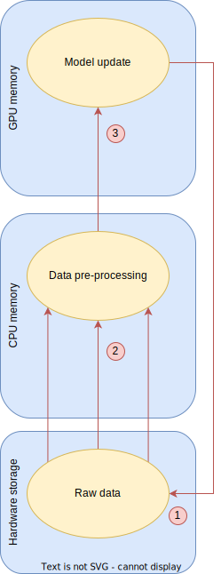
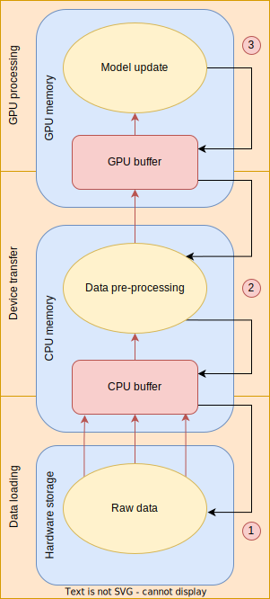
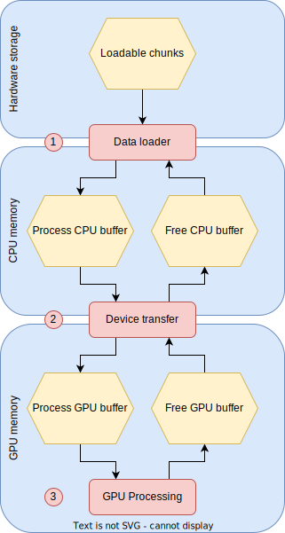

# torch-async
Torch Async performs asynchronous data loading and model training for PyTorch.

It was designed to overcome the limitations of the sequential nature of PyTorch standard training loop by removing locks in the data loading and model training process.

There are two classes to be subclassed:
- the `ChunkDataloader` class: loads the data by chunks to be processed by the model's logic
- the `Model` class: derived from PyTorch's `Module` class and provides a `fit` method
 
<!-- TOC -->
- [1. Description](#1-description)
- [2. Installation](#2-installation)
- [3. Subclassing ChunkDataloader](#3-subclassing-chunkdataloader)
- [4. Training an async model](#4-training-an-async-model)
- [5. Examples](#5-examples)
- [6. Known issues](#6-known-issues)
<!-- /TOC -->

## 1. Description

The standard data loading and training step is displayed in Figure 1 (left): 
1) loading a batch of samples from hardware storage (SSD, network storage...) to CPU memory,
2) pre-processing a data batch (unpacking data, normalization...) and moving it to GPU memory,
3) performing a training step on the model.

As each step is performed in a synchronous way (even if steps 1 and 2 can be achieved using multiple workers, the batch collate and training steps are done synchronously), locks occur in the process and resources are left unused.

What Torch Async does is to decouple these different steps by running them using different processes as shown in Figure 1 (right):
1) loading a chunk of samples (i.e. multiple batches) from hardware storage (SSD, network storage...) to a CPU buffer,
2) pre-processing a data chunk and moving it to a GPU buffer,
3) performing multiple training steps on the model with the data chunk from the GPU buffer.

<p align="center">
    
    
</p>
<p align = "center">
Figure 1: Standard sequential training flow (left) and decoupled multi-process training flow (right). 
</p>

A more detailed explanation on how this asynchronous data loading and model training is performed is shown in Figure 2.
Five queues are used to sent messages:
- `loadable chunks`: is initialized with the list of data chunks to be loaded and processed,
- `free CPU buffer`: contains the indices of free CPU buffers which can be filled with new data chunks,
- `process CPU buffer`: once a data chunk is loaded to a CPU buffer, a message is sent via this queue to notify that this data chunk is ready to be processed,
- `free GPU buffer`: contains the indices of free GPU buffer which can be filled with data from a CPU buffer,
- `process GPU buffer`: once a data chunk is moved to a GPU buffer, a message is sent via this queue to notify that this data chunk is ready to be processed.

Three asynchronous processes use the above queues to communicate:
1) the `data loader` process reads messages from the `loadable chunks` queue and the `free CPU buffer` queue. Once a chunk has been loaded into a CPU buffer, a message is sent to the `process CPU buffer` queue,
2) the `device transfer` process reads messages from the `process CPU buffer` queue and moves the data to a free GPU buffer using the `free GPU buffer` queue. Once a chunk has been moved to a GPU buffer, a message is sent to the `free CPU buffer` queue and the `process GPU buffer` queue, 
3) the `GPU processing` process reads messages from the `process GPU buffer` queue and once all batches from the chunk have been used for training, it writes it to the `free GPU buffer` queue.

<p align="center">
    
</p>
<p align = "center">
Figure 2: Detailed description of the data loading and model training asynchronous process flow. 
</p>

## 2. Installation

```bash
git clone git@github.com:gsicard/torch-async.git
cd torch-async
pip install --upgrade .
```

## 3. Subclassing ChunkDataloader

In order to subclass `ChunkDataloader`, 5 abstract methods need to be implemented.
1. `load_chunk`: loads a chunk of data and returns a tuple of number of samples, features array and labels array
2. `sample_size`: returns the size of a sample as a 1D-array
3. `num_items`: returns a list of number of samples per chunk
4. `num_chunks`: returns the number of chunks that can be loaded
5. `__len__`: returns the total number of samples in the dataset

## 4. Training an async model

An async model is derived from PyTorch's `Module` class. As such it is easy to implement a model the standard PyTorch way.

```python
from torch_async import Model

class MyModel(Model):
    def __init__(self):
        ...

    def forward(self, x):
        ...
```

Once the model has been created and the training and validation chunk dataloaders have been subclassed, the training can be started by simply running:

```python
model = MyModel()

model.fit(train_dataloader,
          epochs=10,
          valid_dataloader=valid_dataloader,
          batch_size=512)
```
## 5. Examples

to be added in issue #3

### 5.1 CIFAR-10

The code located [here](examples/cifar10/cifar10_torchasync.py) shows how to train a VGG model on the CIFAR-10 dataset using torch-async. 
The standard PyTorch implementation is provided for comparison [here](examples/cifar10/cifar10_torchvision.py).
Since CIFAR-10 is a very small dataset, it is pre-loaded to CPU memory by the corresponding PyTorch `Dataset` subclass so the standard training loop is already very fast (torch-async is intended for cases where the dataset is too large to be loaded to memory).

The following table shows the training time differences between the standard training loop and torch-async for 10 epochs of VGG-11-BN on CIFAR-10:

| Implementation | Duration |
|----------------|----------|
| standard loop | 181.69 +- 0.83 s |
| torch-async | 171.79 +- 7.82 |

## 6. Known issues

- child processes might not exit nicely from keyboard interrupt
- no support for callbacks (issue #5)
- no implementation of predict and evaluate functions
- no support for memory pre-loading (both CPU and GPU)
- no support for resuming from existing checkpoint
